<div align="center">

# StateScope

**面向时间序列状态分析的综合生态系统**

PVLDB 愿景论文的参考实现 + 交互式演示

[📄 论文](https://vldb.org/pvldb/) · [🇬🇧 English](README.md)


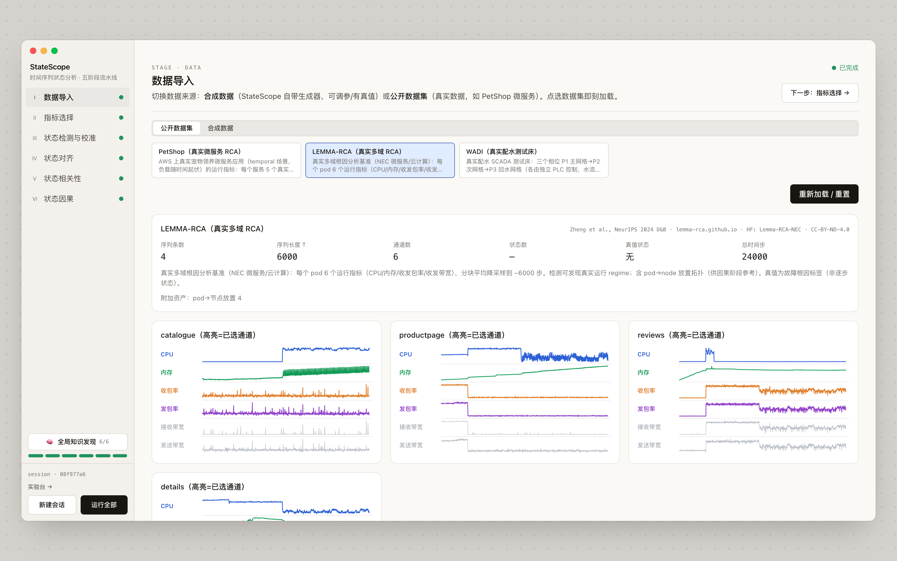

</div>

---

时间序列分析长期是**以数值为中心**的。论文指出，被监控的系统用**状态**来理解更自然 —— 一串运行模式 ——
而状态检测应当是分析的**起点**而非终点。StateScope 把它做成了可端到端运行的系统：

```
① 数据基础设施  →  ② 特征工程  →  ③ 状态检测  →  ④ 状态相关性  →  ⑤ 状态因果
  标注 · 对齐         指标选择       原始序列→状态     六类关系         随运行态变化
```

| | |
|---|---|
| **一套数据契约** | `MTS → StateSequence → AlignedStates → CorrelationResult / ClusterCausalResult` —— 每个阶段可独立测试，阶段之间无需重新解析 |
| **三种标注场景** | 全标注（ISSD）· 弱标注（边界事件）· 无标注（排序） |
| **对齐即构造** | 序列拼接后只检测一次，同一物理状态天然拿到同一个全局 id |
| **人在回路** | 校准工作台可调边界、拆/并段、改状态；下游阶段自动作废 |
| **确定性** | 相同输入 → 逐字节一致的状态与因果图 |
| **真实数据** | PetShop · LEMMA-RCA · WADI，外加带真值的合成级联生成器 |

## 快速开始

```bash
uv sync --extra dev --extra demo      # 引擎 + API（Python 3.11, torch 2.x）；--extra causal 装 PCMCI+
pnpm install && pnpm dev:full         # API :8000 + web :5173
```

选一个数据集，按 **运行全部**，或逐阶段推进。界面中英双语。

---

# 演示实录 —— LEMMA-RCA

[LEMMA-RCA](https://lemma-rca.github.io/) `product_review`，2021-05-17 —— 一次真实注入 CPU 高负荷故障的当天。
四个 Bookinfo pod（`catalogue`、`productpage`、`reviews`、`details`）× 6 指标 × 6 000 步，
**没有任何逐时刻状态标签**：下面的一切都是从数据里发现的，参数为该数据集的界面默认值。

## ① 数据导入

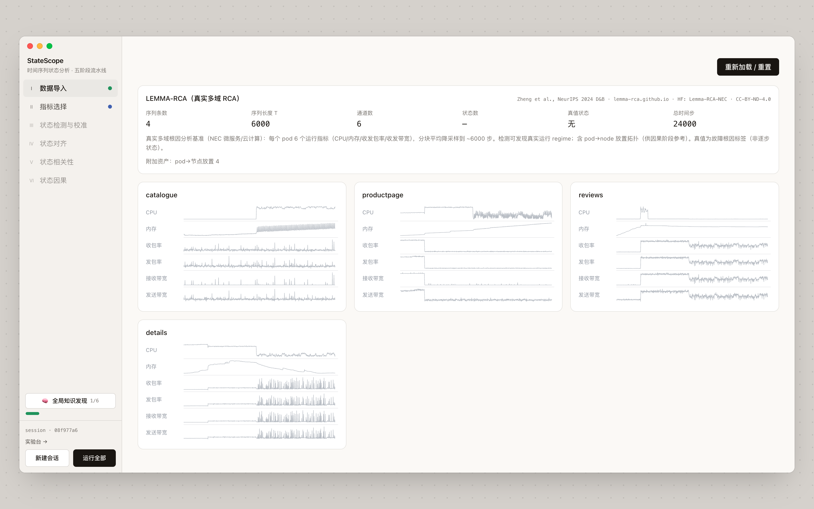

4 条序列、6 个通道、24 000 个样本。数据集还自带 pod→node 放置图，后面因果阶段会用作参考拓扑。

## ② 指标选择 —— 无标注

**6 → 4**：保留 `CPU`、`内存`、`收/发包率`；与包率冗余的两路带宽被剔除。选中的通道带台阶式电平变化，
剔除的则是尖刺、平稳的通道。

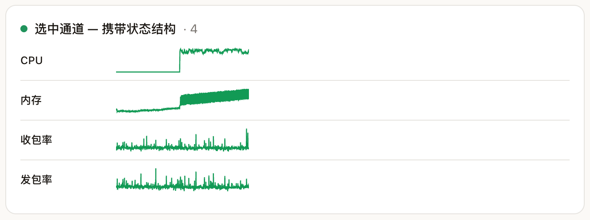 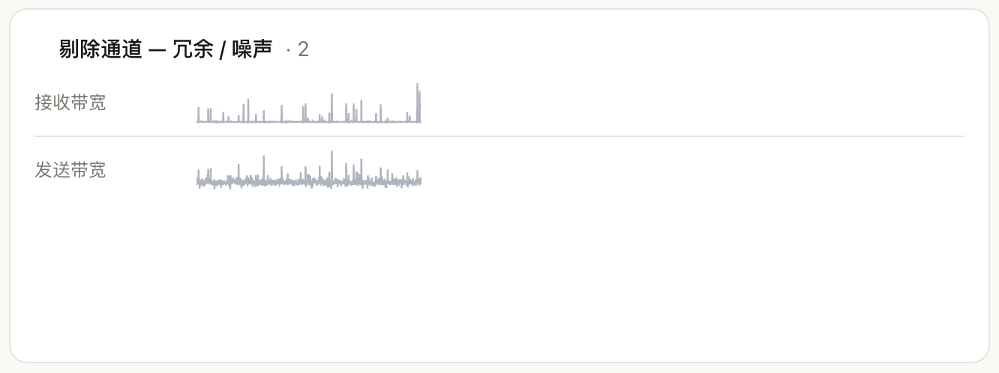

## ③ 状态检测与校准

每条序列变成一个状态序列。四个 pod **各自独立编号** —— 3、4、3、5 个 —— 所以颜色还对不上。

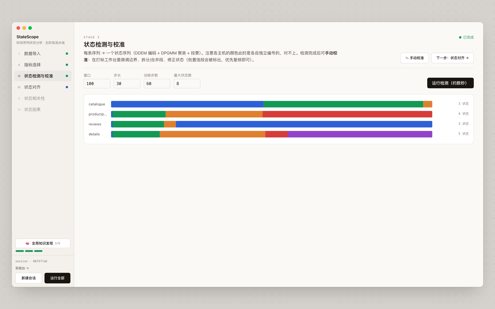

**✎ 手动校准**打开打标工作台：拖边界、双击拆分、单击换状态或合并、滚轮循环切换状态。低置信段会被标出，
只复核可疑处即可；应用修改后对齐及下游自动作废。

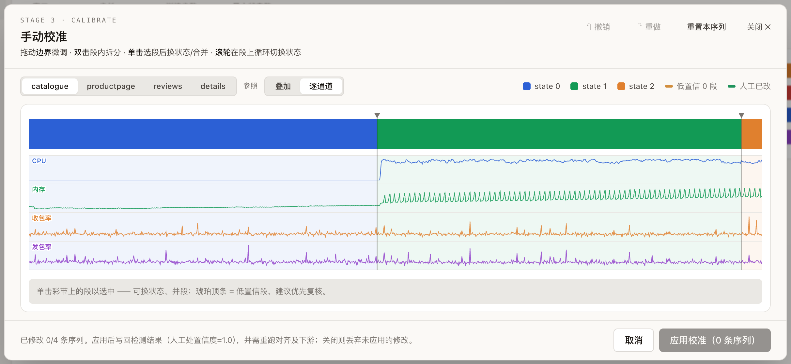

## ①·3 状态对齐

所有序列映射到统一的 **7 个全局状态** —— 现在同色 = 同一物理状态。转移图把所有切换汇总成
P(下一状态 | 当前状态)，勾勒出主干 **S5 → S3 → S4**。

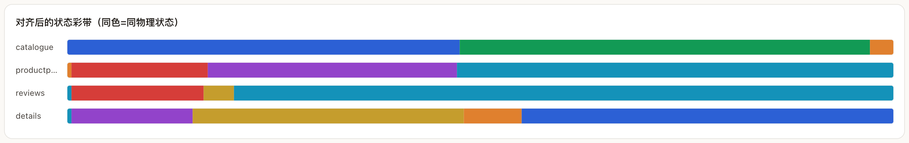

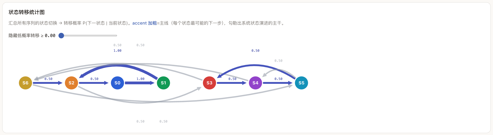

## ④ 状态相关性

**服务-状态影响流**：每个服务一条彩带、共享时间轴，弧线 = 时滞影响，虚线框 = 同期共现。
默认阈值下留下 7 条链路。

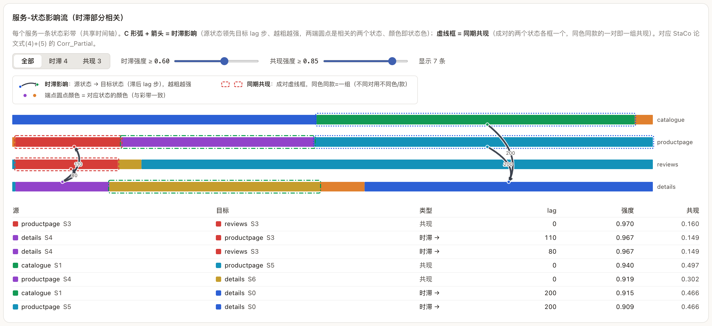

| 源 | 目标 | 类型 | lag | 强度 |
|---|---|---|---|---|
| `productpage` S3 | `reviews` S3 | 共现 | 0 | 0.970 |
| `details` S4 | `productpage` S3 | 时滞 → | 110 | 0.967 |
| `details` S4 | `reviews` S3 | 时滞 → | 80 | 0.967 |
| `catalogue` S1 | `productpage` S5 | 共现 | 0 | 0.940 |
| `catalogue` S1 | `details` S0 | 时滞 → | 200 | 0.915 |

整体一致性只算中等（平均 NMI 0.58），而单对可达 0.81 —— 全局一致性低估了那些带时滞的、部分的关系，
这正需要其余几类视图来恢复。

 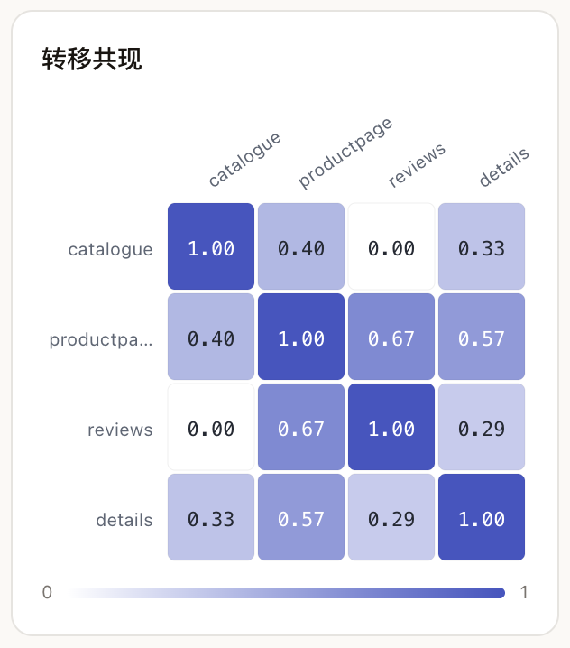 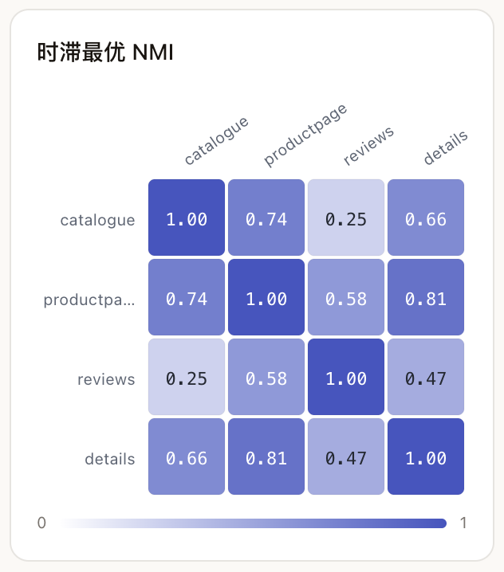

## ⑤ 状态因果

把集群当作**一个对象**：4 pod × 4 通道 → 16 通道序列，E2USD 切出 **2 个运行态**，每个 regime 内一张
masked PCMCI+ 图。实线 = 同期、虚线 = 滞后、粗细 ∝ |偏相关|；节点边框 = pod、内填 = 指标。

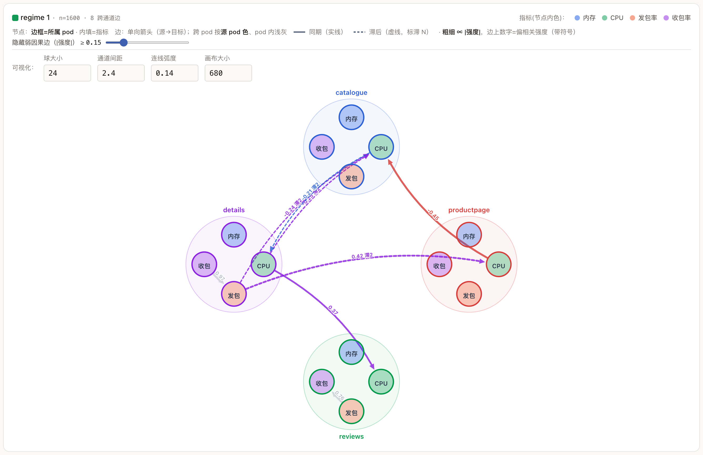

**regime 1**（故障活跃的后半段，n = 1 600）的跨 pod 结构为 `details:CPU → productpage:CPU`（+0.42，滞后 2）、
`details:CPU → reviews:CPU`（+0.37）与 `productpage:内存 → catalogue:CPU`（−0.45）；pod 内部则出现物理上的
`收包率 → 发包率`，|s| ≈ 0.97。regime 0 更稀疏 —— 同一对通道在一个 regime 里相连、在另一个里断开，
这就是"随运行态变化的因果"。

<details><summary>开发者视图 —— 真值叠加</summary>

LEMMA 没有调用图，但有 pod→node 放置：`catalogue`、`details`、`productpage` 同在一个 node，`reviews` 单独在
另一个。灰色虚线弧就是这个参考 —— 发现的因果边集中落在同置的 pod 对上。

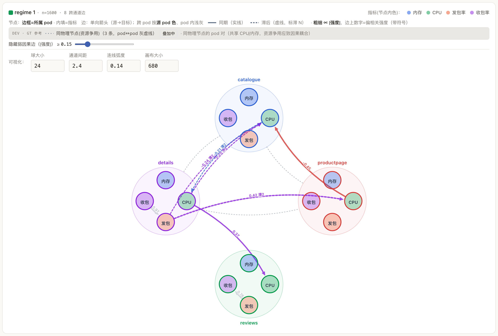

</details>

## 🧠 全局知识发现

每个阶段一段文字结论 + 一张重点图，最后以跨阶段互证的**综合规律**收尾 —— 对应论文中的
*actionable rules, knowledge*。它随流水线推进逐步长出来。

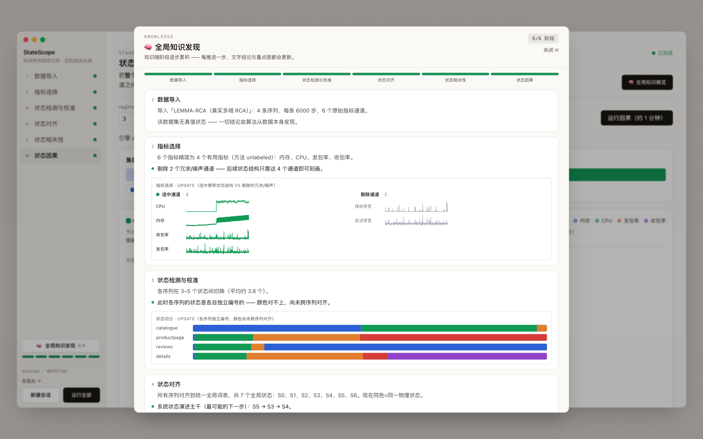

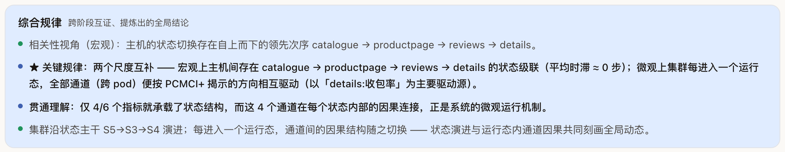

---

## 流水线 ↔ 论文

论文路线图的每个阶段对应一个组件，按注册名可整体替换。

| 论文阶段 | 组件 | 注册名 | 基于 |
|---|---|---|---|
| §3.1 数据基础设施 —— 标注 · 合成数据 · **对齐** | `stage1_infra/alignment/concat_aligner.py` · `io/synthetic.py` · 校准工作台 | `aligner: concat` | FastTSA（Du 等，投 IEEE SMC 2026） |
| §3.2 特征工程 —— 全 / 弱 / 无标注 | `stage2_features/{issd_selector, weak_ranker, unlabeled_ranker}.py` | `selector: issd · weak · unlabeled` | ISSD（SIGMOD 2025）· Time2State（SIGMOD 2023） |
| §3.3 状态检测 | `stage3_detection/detector.py` | `detector: e2usd` | E2USD（WWW 2024）· Time2State（SIGMOD 2023） |
| §3.4 状态相关性 | `stage4_correlation/analyzers.py` | `correlation: overall · transition · partial · time_lagged · structural · state_link` | StaCo（AAIA 2024） |
| §3.5 状态因果 | `stage5_causality/{cluster, pcmci, apriori}.py` | 集群引擎 `e2usd_pcmci`；`causality: apriori`（备用） | PCMCI+（Runge 等, Sci. Adv. 2019 / UAI 2020）· E2USD |

## 数据集

| 数据集 | 是什么 | 真值 | 获取 |
|---|---|---|---|
| 抽象合成 | 多主机级联序列，可调参，注入噪声通道 | 逐时刻状态 | 内置 |
| [PetShop](https://github.com/amazon-science/petshop-root-cause-analysis) | 真实 AWS 微服务，每服务 5 个指标 | 调用图 + 故障根因 | 已 vendoring（CC-BY-4.0） |
| [LEMMA-RCA](https://lemma-rca.github.io/) | NEC 微服务 / 云，每 pod 6 个指标 | 故障根因 + pod→node 放置 | `data_origin/lemma_rca/`（CC-BY-ND） |
| [WADI](https://itrust.sutd.edu.sg/itrust-labs_datasets/) | 配水 SCADA，3 个相位 | 攻击标签 + 水流方向 | `data_origin/WaDi.zip`（需 iTrust 协议） |

## 引用

```bibtex
@article{wang2026statescope,
  title   = {Towards a Comprehensive Ecosystem for Time Series State Analysis [Vision]},
  author  = {Wang, Chengyu and Du, Yimin and Zhao, Shan and Liao, Xin and
             Zhou, Tongqing and Cai, Zhiping and Wang, Meng},
  journal = {Proceedings of the VLDB Endowment},
  year    = {2026}
}
```

## 致谢

基于 [Time2State](https://github.com/Lab-ANT/Time2State)、[E2USD](https://github.com/AI4CTS/E2USD)、
[ISSD](https://github.com/Lab-ANT/ISSD)、labelState 与
[tigramite](https://github.com/jakobrunge/tigramite)；以及 PetShop、LEMMA-RCA、WADI 数据集。
