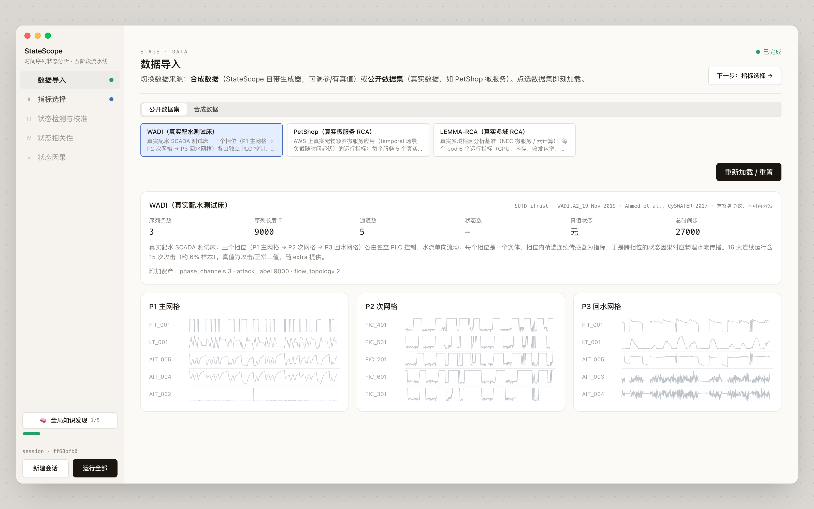
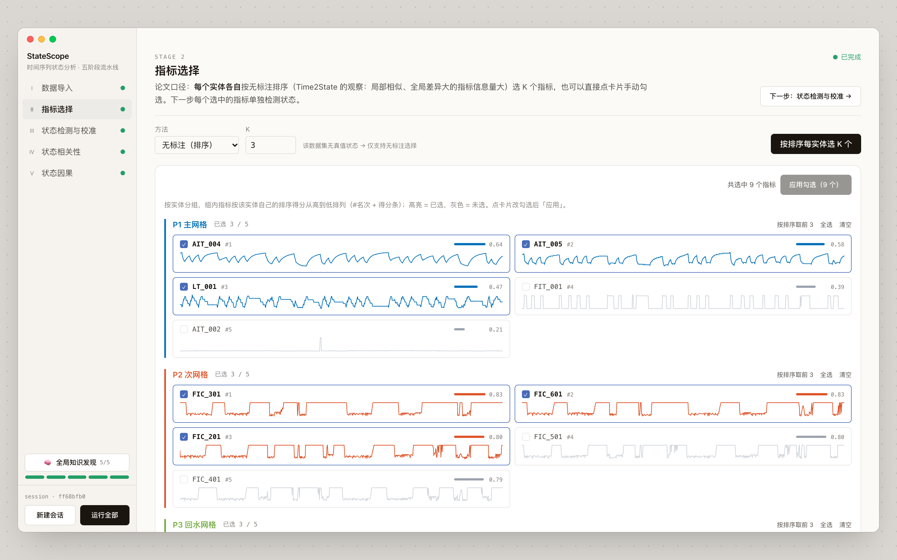
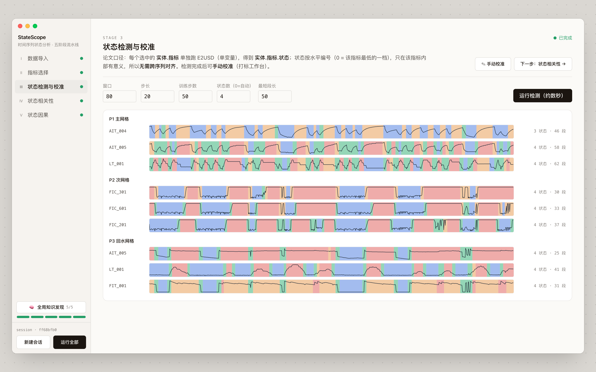
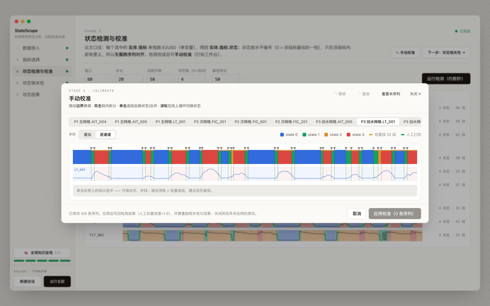
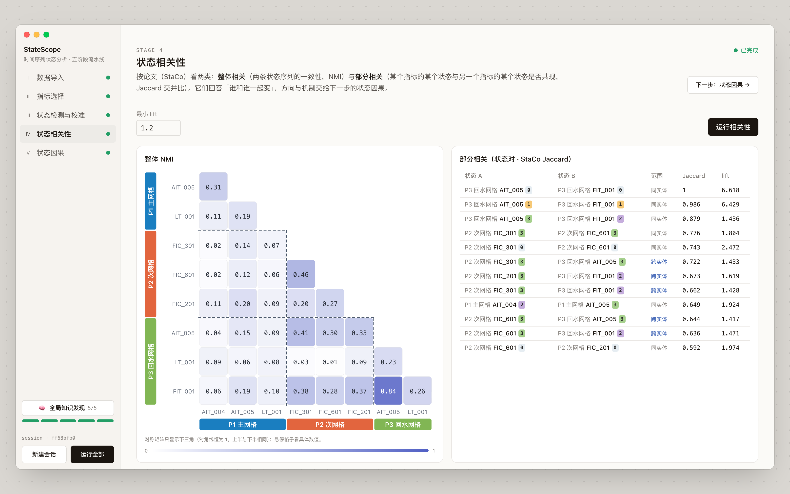
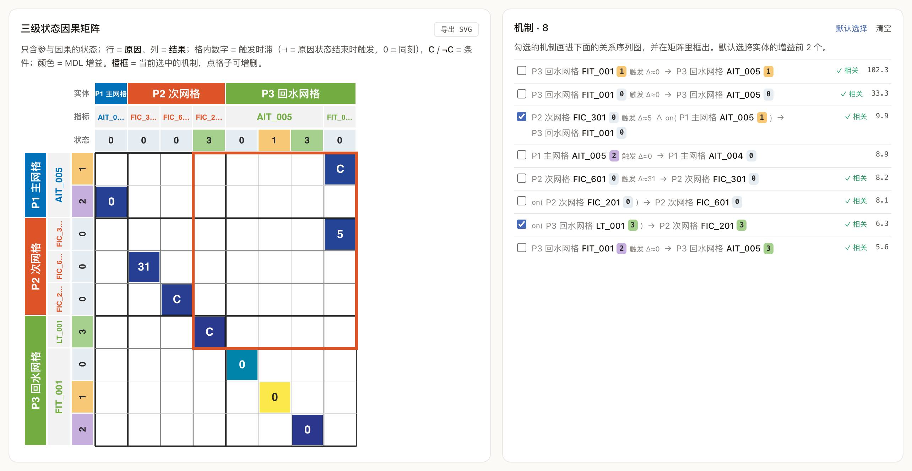
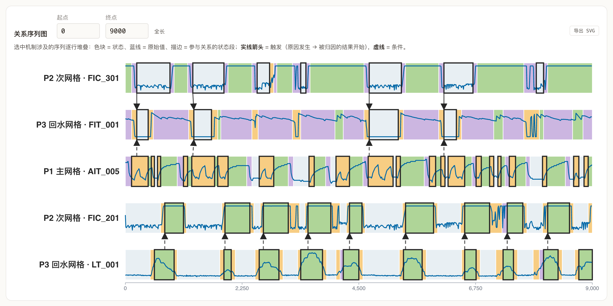

<div align="center">

# StateScope

**Time Series State Analysis: A State-Centric Vision**

PVLDB 2027 愿景论文所设想的状态分析系统原型

[📄 论文](https://vldb.org/pvldb/) · [🇬🇧 English](README.md)


</div>

---

时间序列状态检测把原始序列切分成若干段，并给每段打上状态标签，从而把数值观测转换成状态序列。现有工作大多把状态当作
分析的终点。论文提出**时间序列状态分析**：以状态为核心，连接原始观测与知识发现，并给出一个覆盖数据基础设施、特征
工程、状态检测和高阶状态分析的研究框架。

<p align="center"><br><em>论文图 3：所设想的状态分析系统框架。</em></p>

StateScope 是论文 §5 中用来演示该框架的原型。下面按组件逐一介绍，示例数据为工业配水实验平台 WADI。

## 快速开始

```bash
uv sync --extra demo                  # Python 3.11，torch 2.x
pnpm install && pnpm dev:full         # API :8000 + 前端 :5173
```

选一个数据集，点「运行全部」，或逐阶段运行。界面支持中英文切换。WADI 需要与 iTrust 签署数据协议（见
`data_origin/wadi/README.md`）；没有 WADI 数据时，默认改用仓库自带的 PetShop。

## 数据基础设施：数据导入



来自服务器与工业系统的监控数据被整理成统一形式：每个实体（如 WADI 的一个阶段、一个微服务）是一组指标构成的多变量
序列。演示内置 WADI、PetShop 和 LEMMA-RCA，点选数据集即加载；下游阶段在运行前保持灰色。

## 特征工程：指标排序



只有少数指标携带有用的状态信息。在无标注场景下，指标选择被表述为**指标排序**问题：信息量大的指标通常含有在一段
时间内保持稳定的局部模式，而这些模式的组织方式会随时间变化。每个实体各自排序并保留前 K 个指标，也可以手动点选。

## 状态检测



状态检测阶段采用 [E2USD](https://github.com/AI4CTS/E2USD)。每个选中的指标单独检测，得到各自的状态序列；状态在
指标内按水平编号，因此不需要跨序列对齐。检测结果逐个指标呈现，每条状态彩带内叠画该指标的原始曲线。

检测得到的状态还可以用数据基础设施层提供的交互式状态标注工具修正。标注直接在状态彩带上进行，而不是框选区间：
拖动边界微调、双击段内拆分、单击选段后改状态或合并、滚轮循环切换状态。低置信段会被标出，通常只需复核部分段。应用后的修改写回检测结果。



## 高阶分析

### 状态相关性



高阶分析基于 StaCo，分析两类相关性：

- **整体相关**：衡量两条状态序列的全局一致性（NMI）。两条序列的状态标签即使不同，也可能强相关。
- **部分相关**：刻画特定状态之间的依赖（时间重叠，Jaccard）。即使两条序列整体相关性很弱，这种依赖也可能存在。

这两类相关性为因果发现提供候选组件和状态对。

### 状态因果发现



状态因果组件采用[区间事件因果发现方法](https://doi.org/10.1609/aaai.v40i25.39201)（NIAGARA；Cornanguer 等，
AAAI 2026），把每个状态段当作一次区间事件。矩阵在系统、指标、状态三个层级上汇总发现的依赖关系：

- 行是原因，列是结果；
- 颜色表示 MDL 增益，数字表示平均触发时滞；
- C 表示以源状态正在持续为条件的依赖。

勾选的机制会在关系序列图中逐次画出：



在 WADI 上，三个阶段（一级供水网 P1、二级配水网 P2、回水网 P3）各保留排序前三的指标。发现的依赖包括：

- **P2 → P3：** P2·FIC_301 的状态 0 约 5 步后触发 P3·FIT_001 的状态 0，前提是 P1·AIT_005 处于状态 1。
- **P3 与 P2：** P2·FIC_201 的状态 3 主要在回水箱液位 P3·LT_001 处于高位（状态 3）时出现。
- **P2 内部：** FIC_601 的状态 0 关联到 FIC_301 的状态 0，时滞约 31 步。


## 引用

```bibtex
@article{wang2027statescope,
  title   = {Time Series State Analysis: A State-Centric Vision [Vision]},
  author  = {Wang, Chengyu and Du, Yimin and Zhou, Tongqing and Zhao, Shan and
             Liao, Xin and Cai, Zhiping},
  journal = {Proceedings of the VLDB Endowment},
  year    = {2027}
}
```

## 致谢

基于 [Time2State](https://github.com/Lab-ANT/Time2State)、[E2USD](https://github.com/AI4CTS/E2USD)、
[ISSD](https://github.com/Lab-ANT/ISSD)、[FastTSA](https://github.com/BuiltByDu/FastTSA)、StaCo 与 [NIAGARA](https://doi.org/10.1609/aaai.v40i25.39201) 构建。
数据：WADI、PetShop、LEMMA-RCA。许可见 `NOTICE`。
