<div align="center">

# StateScope

**Towards a Comprehensive Ecosystem for Time Series State Analysis**

Reference implementation and interactive demo of the PVLDB vision paper

[📄 Paper](https://vldb.org/pvldb/) · [🇨🇳 中文](README-ZH.md)


</div>

---

Time series analysis has long been **value-centric**. The paper argues that monitored systems are better
understood **state-centrically** — as sequences of operating modes — and that state detection should be the
*beginning* of analysis, not the end. StateScope makes that runnable end to end:

```
① Data infrastructure  →  ② Feature engineering  →  ③ State detection  →  ④ Correlation  →  ⑤ Causality
  labeling · alignment       indicator selection       raw MTS → states      6 relation types   regime-modulated
```

|                                     |                                                                                                                                                                    |
| ----------------------------------- | ------------------------------------------------------------------------------------------------------------------------------------------------------------------ |
| **One data contract**         | `MTS → StateSequence → AlignedStates → CorrelationResult / ClusterCausalResult` — every stage is independently testable, nothing is re-parsed between stages |
| **Three labelling regimes**   | fully-labelled (ISSD) · weakly-labelled (boundary events) · unlabelled (ranking)                                                                                 |
| **Alignment by construction** | series are concatenated and detected once, so the same physical state gets the same global id                                                                      |
| **Human in the loop**         | a calibration workbench for boundaries, splits/merges and relabels; downstream stages invalidate automatically                                                     |
| **Deterministic**             | identical inputs → byte-identical states and graphs                                                                                                               |
| **Real data**                 | PetShop · LEMMA-RCA · WADI, plus a synthetic cascade generator with ground truth                                                                                 |

## Getting started

```bash
uv sync --extra dev --extra demo      # engine + API (Python 3.11, torch 2.x); --extra causal adds PCMCI+
pnpm install && pnpm dev:full         # API :8000 + web :5173
```

Pick a dataset, then press **Run all** or advance one stage at a time. The UI is bilingual (English / 中文).

---

# Walkthrough — LEMMA-RCA

[LEMMA-RCA](https://lemma-rca.github.io/) `product_review`, 2021-05-17 — a day with an injected CPU-hog
fault. Four Bookinfo pods (`catalogue`, `productpage`, `reviews`, `details`) × 6 metrics × 6 000 steps, with
**no per-timestep state labels**: everything below is discovered from the data, using the defaults the UI
applies for this dataset.

## ① Data import

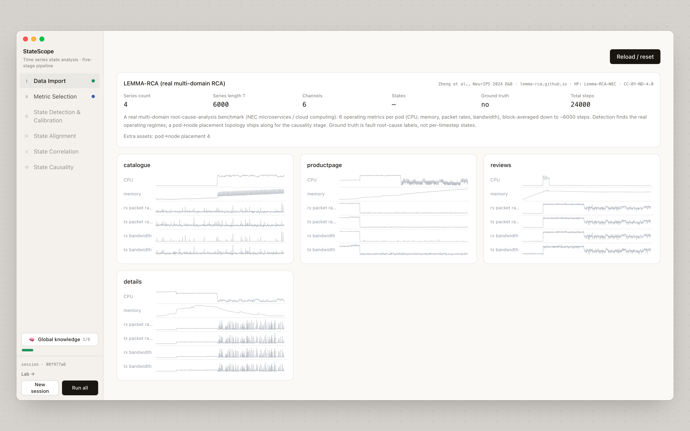

Four series, six channels, 24 000 samples. The dataset also ships a pod→node placement map, used later as a
reference topology.

## ② Metric selection — unlabelled

**6 → 4.** `CPU`, `memory`, `rx/tx packet rate` are kept; the two bandwidth channels, redundant with the
packet rates, are dropped. The selected channels carry step-like level shifts; the dropped ones are spiky
and stationary.

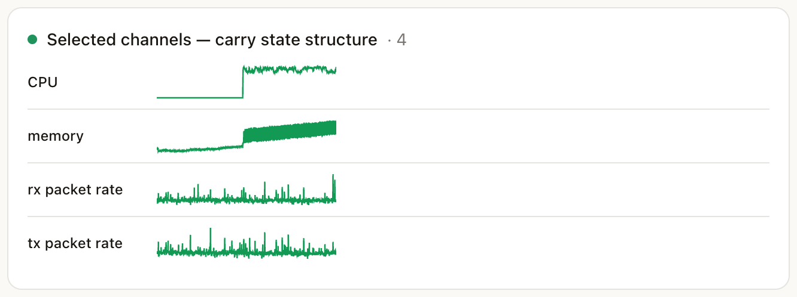 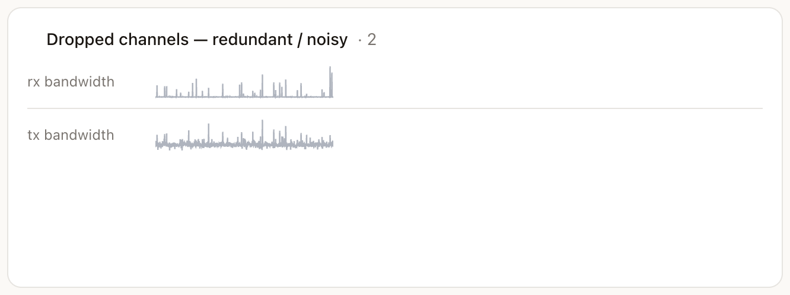

## ③ State detection & calibration

Each series becomes a state sequence. The four pods number their states **independently** — 3, 4, 3 and 5 —
so the colours do not line up yet.

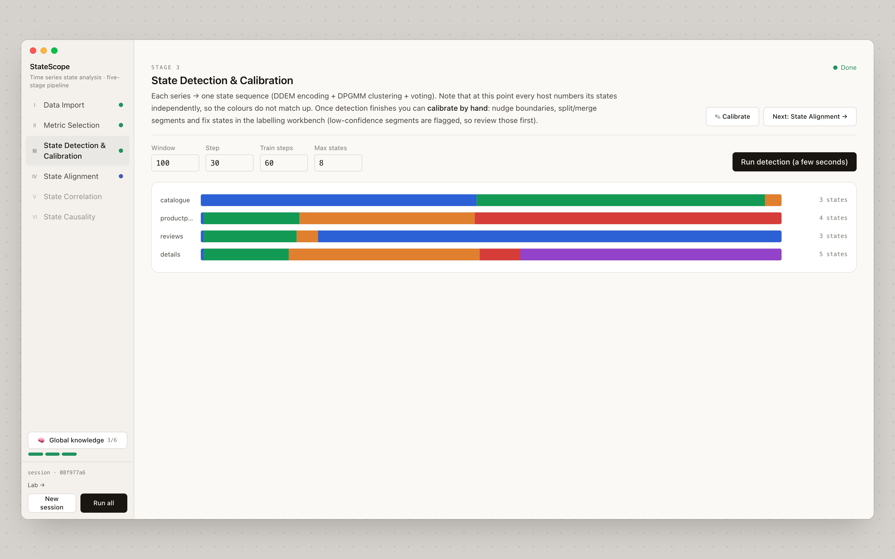

**✎ Calibrate** opens the labelling workbench: drag a boundary, double-click to split, click to relabel or
merge, scroll to cycle states. Low-confidence segments are flagged so partial review is enough; applying the
edits invalidates alignment and everything downstream.

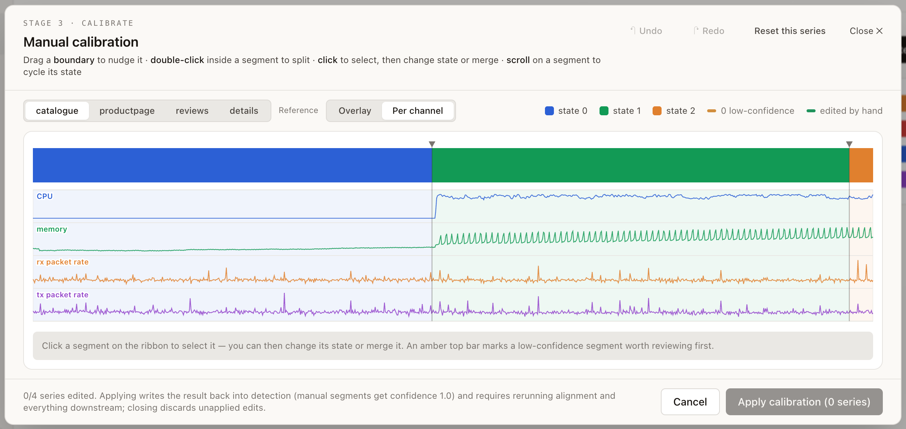

## ①·3 State alignment

All series map onto one global vocabulary of **7 states** — same colour now means the same physical state.
The transition graph aggregates every switch into P(next | current), tracing the backbone **S5 → S3 → S4**.

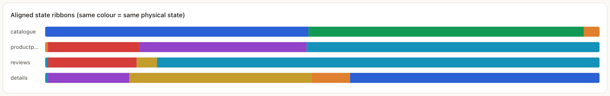

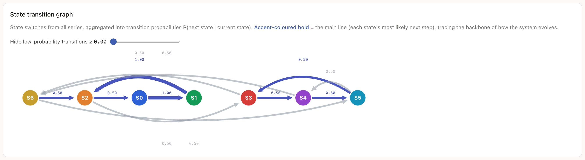

## ④ State correlation

The **service-state influence flow**: one ribbon per service on a shared time axis, arcs for lagged
influence, dashed boxes for contemporaneous co-occurrence. Seven links survive the default thresholds.

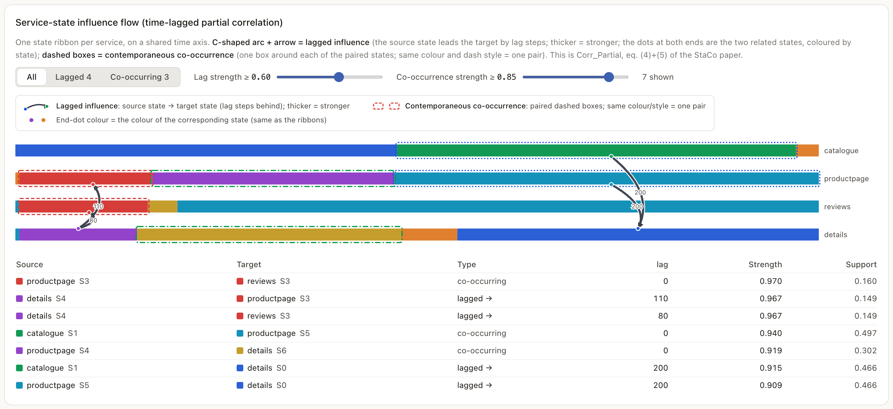

| Source             | Target             | Type         | lag | Strength |
| ------------------ | ------------------ | ------------ | --- | -------- |
| `productpage` S3 | `reviews` S3     | co-occurring | 0   | 0.970    |
| `details` S4     | `productpage` S3 | lagged →    | 110 | 0.967    |
| `details` S4     | `reviews` S3     | lagged →    | 80  | 0.967    |
| `catalogue` S1   | `productpage` S5 | co-occurring | 0   | 0.940    |
| `catalogue` S1   | `details` S0     | lagged →    | 200 | 0.915    |

Overall agreement is only moderate (mean NMI 0.58) while individual pairs reach 0.81 — global consistency
understates the lagged, partial relations that the other views recover.

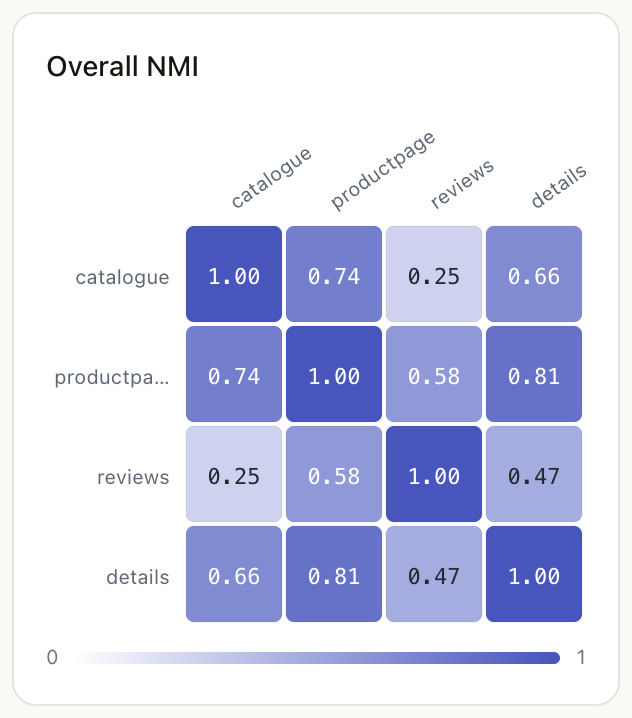 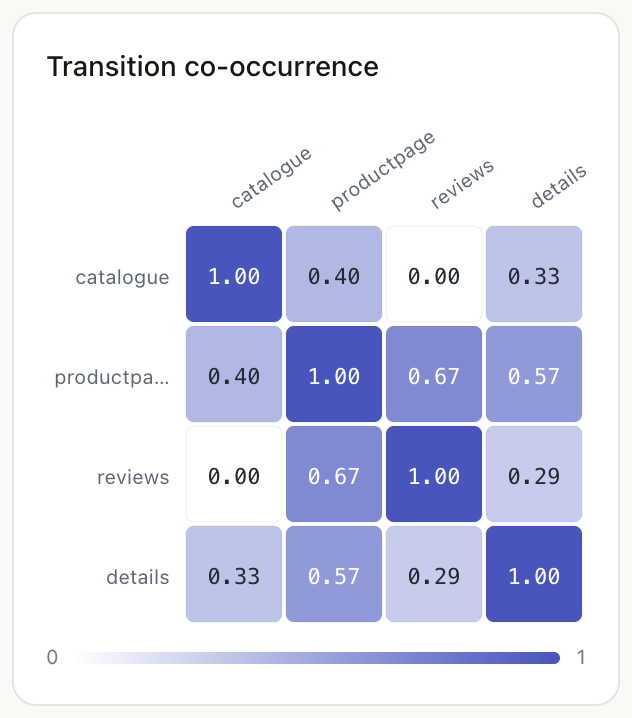 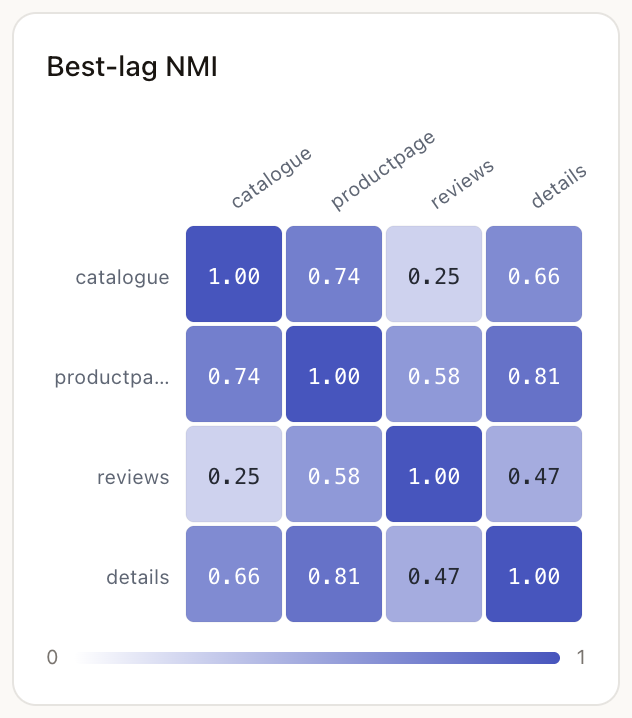

## ⑤ State causality

The cluster is treated as **one object**: 4 pods × 4 channels → 16-channel series, split by E2USD into
**2 operating regimes**, with a masked PCMCI+ graph inside each. Solid = contemporaneous, dashed = lagged,
width ∝ |partial correlation|; node border = pod, fill = metric.

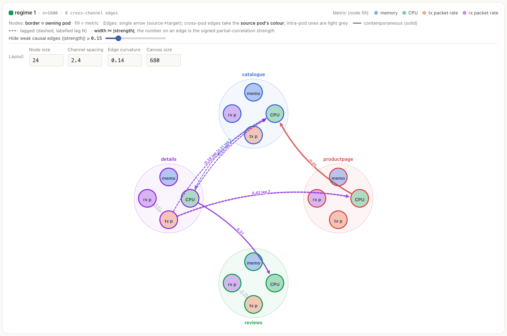

In **regime 1** (the fault-active half, n = 1 600) the cross-pod structure is
`details:CPU → productpage:CPU` (+0.42, lag 2), `details:CPU → reviews:CPU` (+0.37) and
`productpage:memory → catalogue:CPU` (−0.45); inside each pod the physical `rx → tx packet rate` link shows
up at |s| ≈ 0.97. Regime 0 is sparser — the same pair can be connected in one regime and absent in another,
which is what regime-modulated causality means.

<details><summary>Developer view — ground-truth overlay</summary>

LEMMA ships no call graph, but it ships pod→node placement. `catalogue`, `details` and `productpage` share
a node; `reviews` sits alone. Grey dashed arcs are that reference — the discovered edges concentrate on the
co-located pairs.

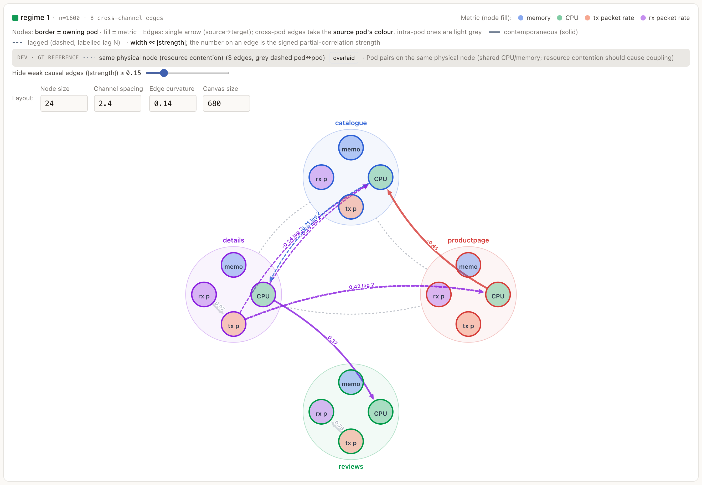

</details>

## 🧠 Global knowledge

One paragraph and one key figure per stage, closing with a cross-stage **synthesis** — the paper's
*actionable rules, knowledge* box. It grows as the pipeline advances.

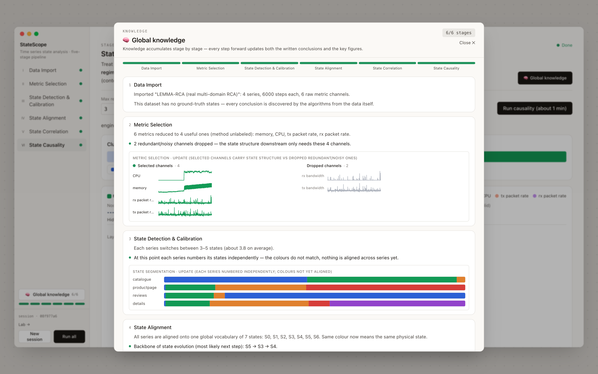

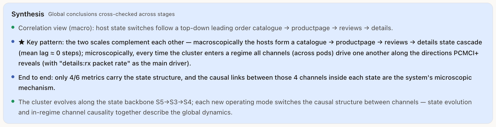

---

## Pipeline ↔ paper

Each stage of the paper's roadmap maps onto one component, registered under a name you can swap out.

| Paper stage | Component | Registry name | Built on |
|---|---|---|---|
| §3.1 Data infrastructure — labeling · synthetic data · **alignment** | `stage1_infra/alignment/concat_aligner.py` · `io/synthetic.py` · calibration workbench | `aligner: concat` | FastTSA (Du et al., IEEE SMC'26 sub.) |
| §3.2 Feature engineering — full / weak / no labels | `stage2_features/{issd_selector, weak_ranker, unlabeled_ranker}.py` | `selector: issd · weak · unlabeled` | ISSD (SIGMOD'25) · Time2State (SIGMOD'23) |
| §3.3 State detection | `stage3_detection/detector.py` | `detector: e2usd` | E2USD (WWW'24) · Time2State (SIGMOD'23) |
| §3.4 State correlation | `stage4_correlation/analyzers.py` | `correlation: overall · transition · partial · time_lagged · structural · state_link` | StaCo (AAIA'24) |
| §3.5 State causality | `stage5_causality/{cluster, pcmci, apriori}.py` | cluster engine `e2usd_pcmci`; `causality: apriori` (fallback) | PCMCI+ (Runge et al., Sci. Adv.'19 / UAI'20) · E2USD |

## Datasets

| Dataset                                                                 | What it is                                                | Ground truth                      | Access                                      |
| ----------------------------------------------------------------------- | --------------------------------------------------------- | --------------------------------- | ------------------------------------------- |
| Abstract synthetic                                                      | cascading multi-host series, tunable, with injected noise | per-timestep states               | built in                                    |
| [PetShop](https://github.com/amazon-science/petshop-root-cause-analysis) | real AWS microservices, 5 metrics/service                 | call graph + root causes          | vendored (CC-BY-4.0)                        |
| [LEMMA-RCA](https://lemma-rca.github.io/)                                | NEC microservices / cloud, 6 metrics/pod                  | root causes + pod→node placement | `data_origin/lemma_rca/` (CC-BY-ND)       |
| [WADI](https://itrust.sutd.edu.sg/itrust-labs_datasets/)                 | water-distribution SCADA, 3 phases                        | attack labels + flow direction    | `data_origin/WaDi.zip` (iTrust agreement) |

## Citation

```bibtex
@article{wang2026statescope,
  title   = {Towards a Comprehensive Ecosystem for Time Series State Analysis [Vision]},
  author  = {Wang, Chengyu and Du, Yimin and Zhao, Shan and Liao, Xin and
             Zhou, Tongqing and Cai, Zhiping and Wang, Meng},
  journal = {Proceedings of the VLDB Endowment},
  year    = {2026}
}
```

## Acknowledgements

Built on [Time2State](https://github.com/Lab-ANT/Time2State), [E2USD](https://github.com/AI4CTS/E2USD),
[ISSD](https://github.com/Lab-ANT/ISSD), labelState and
[tigramite](https://github.com/jakobrunge/tigramite); and on the PetShop, LEMMA-RCA and WADI datasets.
