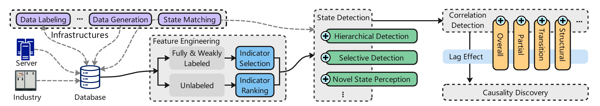
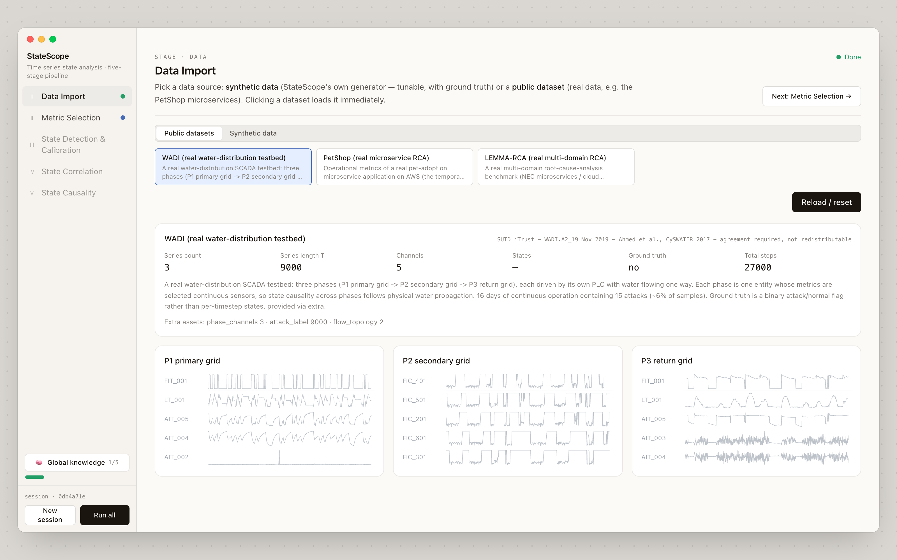
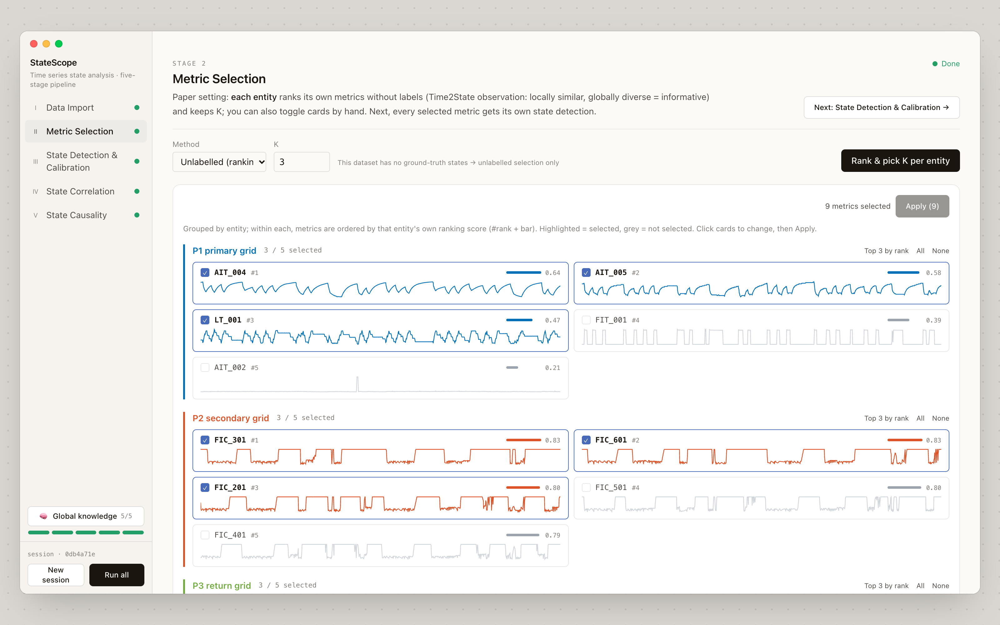
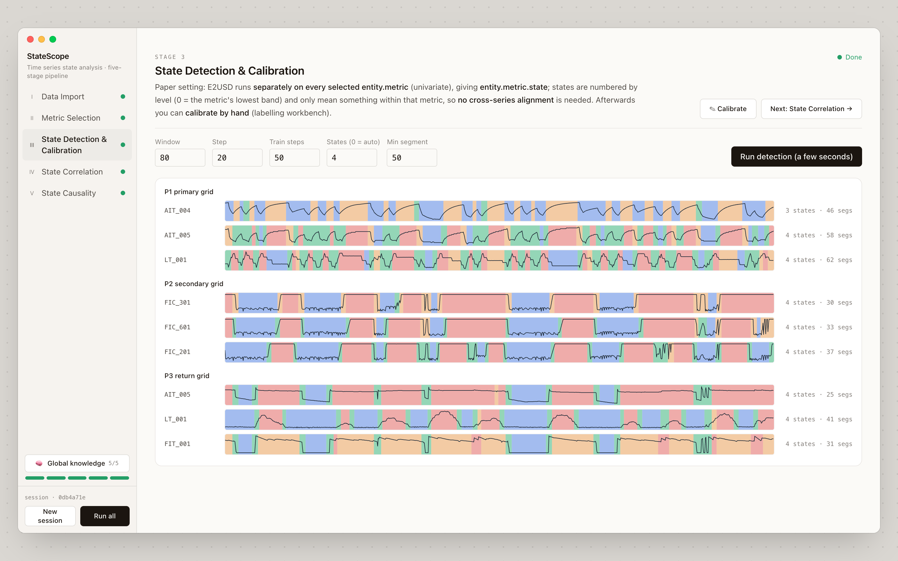
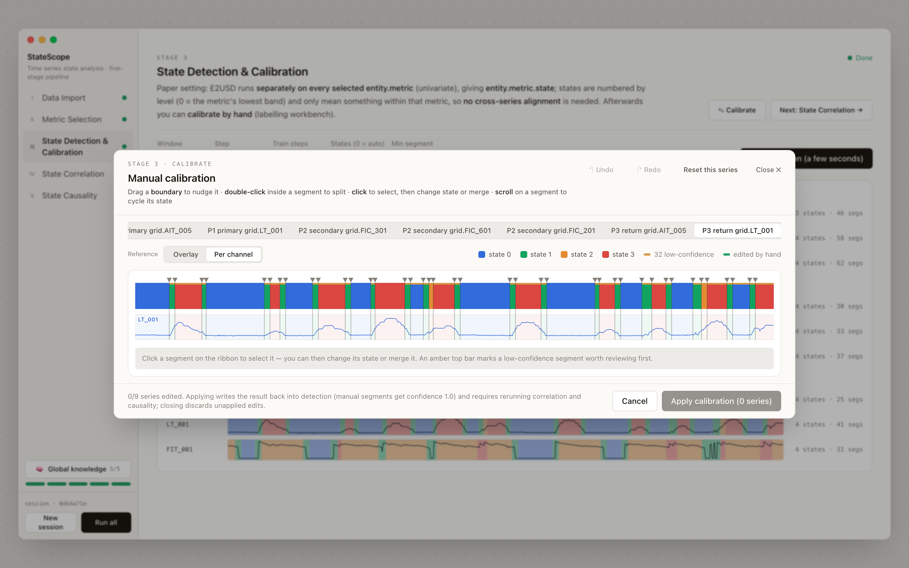
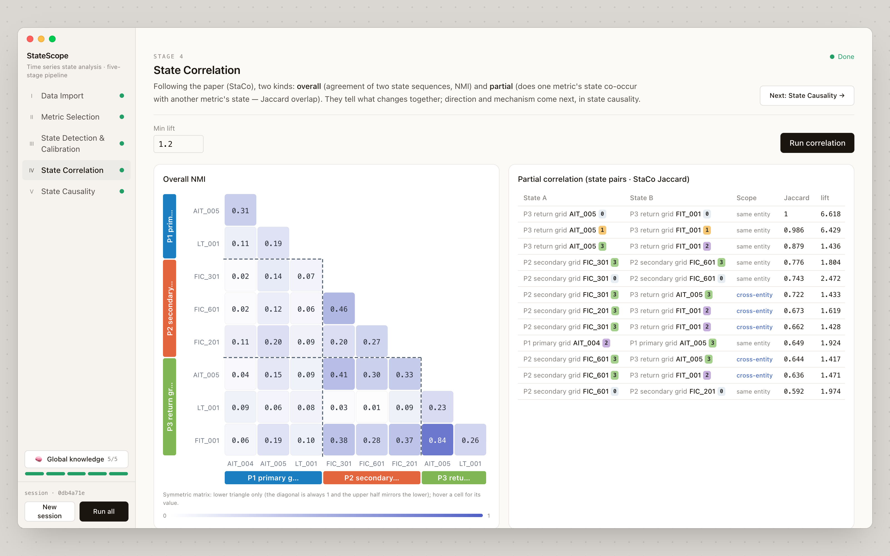
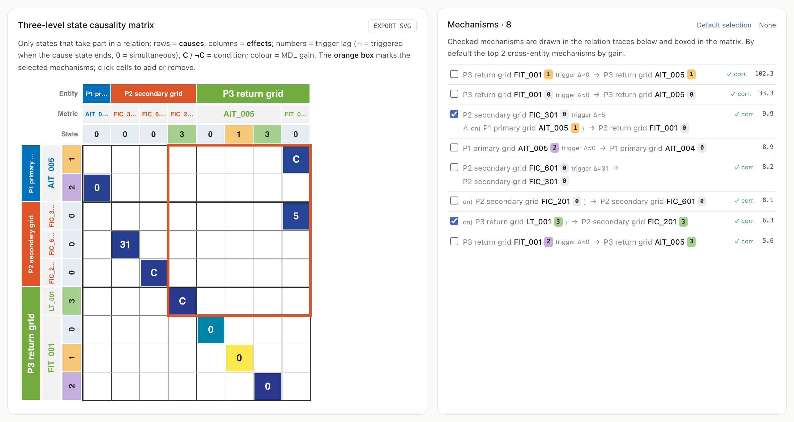
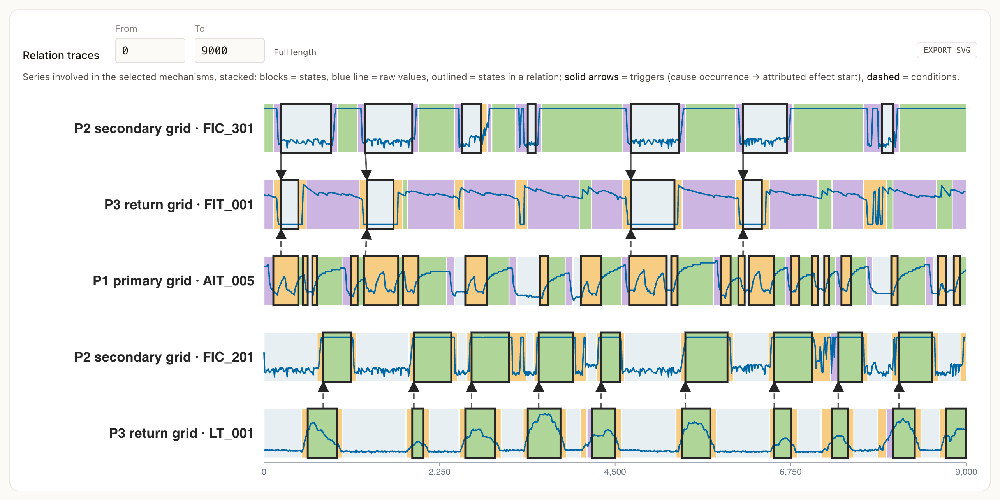

<div align="center">

# StateScope

**Time Series State Analysis: A State-Centric Vision**

Prototype of the state analysis system envisioned in the PVLDB 2027 vision paper

[📄 Paper](https://vldb.org/pvldb/) · [🇨🇳 Chinese](README-ZH.md)


</div>

---

Time series state detection partitions raw time series into segments and assigns each segment a state label,
turning numerical observations into state sequences. Existing work mostly treats states as the end goal. The paper
argues for **time series state analysis**, with states as the central object linking raw observations to knowledge
discovery, and proposes a framework spanning data infrastructure, feature engineering, state detection and
higher-order state analysis.

<p align="center"><br><em>Overview of the envisioned state analysis framework (paper Fig. 3).</em></p>

StateScope is the prototype that demonstrates this framework (paper §5). The components are described below,
illustrated on WADI, an industrial water-distribution testbed.

## Getting started

```bash
uv sync --extra demo                  # Python 3.11, torch 2.x
pnpm install && pnpm dev:full         # API :8000 + web :5173
```

Pick a dataset, then press **Run all** or run the stages one by one. The UI is bilingual (English / Chinese).
WADI needs the iTrust data agreement (see `data_origin/wadi/README.md`). Without it, the demo falls back to
PetShop, which ships with the repository.

## Data infrastructure: data import



Monitoring data from servers and industrial systems is loaded into a common form: each entity (e.g., a WADI stage
or a microservice) is a multivariate series of indicators. The demo ships WADI, PetShop and LEMMA-RCA; picking a
dataset loads it immediately, and the downstream stages stay grey until they are run.

## Feature engineering: indicator ranking



Only a small subset of indicators carries useful state information. Without labels, indicator selection becomes
an **indicator ranking** problem: informative indicators show recurring local patterns that stay stable for a
while, but are organised differently over time. Each entity ranks its own indicators and keeps the top K; cards
can also be toggled by hand.

## State detection



The state detection stage adopts [E2USD](https://github.com/AI4CTS/E2USD). Every selected indicator is detected
on its own and becomes a state sequence. States are numbered by level within each indicator, so no cross-series
alignment is needed. Results stream in metric by metric, with the raw series drawn inside each state ribbon.

The detected states can then be refined with the interactive state labeling tool from the data infrastructure
layer. Labels are edited on the state ribbon directly rather than as bounding boxes: drag a boundary, double-click
to split a segment, click to relabel or merge, scroll to cycle states. Low-confidence segments are flagged, so a
partial review is often enough. Applied edits are written back to the detection result.



## High-order analysis

### State correlation



Higher-order analysis builds on StaCo and covers two kinds of correlation:

- **Overall correlation** measures the global consistency between two state sequences (NMI). Two sequences can be
  strongly correlated even when their labels differ.
- **Partial correlation** captures dependencies between specific states (temporal overlap, Jaccard), which can
  hold even when two sequences are weakly correlated overall.

These correlations point to candidate components and state pairs for causal discovery.

### State causality discovery



The state causality component uses [interval-event causal discovery](https://doi.org/10.1609/aaai.v40i25.39201)
(NIAGARA; Cornanguer et al., AAAI 2026). Each state segment is treated as an interval event. The matrix summarises the
dependencies at three levels: system, metric and state. Rows are causes and columns are effects. Colour encodes
MDL gain, numbers are mean trigger delays, and C marks a dependency conditioned on an ongoing source state. Checked
mechanisms are drawn occurrence by occurrence in the relation traces:



On WADI, each stage (primary grid P1, secondary distribution grid P2, return-water grid P3) keeps its top three
indicators. Among the discovered dependencies:

- **P2 → P3:** state 0 of P2·FIC_301 triggers state 0 of P3·FIT_001 after about 5 steps, while P1·AIT_005 is in
  state 1.
- **P3 and P2:** state 3 of P2·FIC_201 occurs mainly while the return-tank level P3·LT_001 is high (state 3).
- **Within P2:** state 0 of FIC_601 is linked to state 0 of FIC_301, with a delay of about 31 steps.


## Citation

```bibtex
@article{wang2027statescope,
  title   = {Time Series State Analysis: A State-Centric Vision [Vision]},
  author  = {Wang, Chengyu and Du, Yimin and Zhou, Tongqing and Zhao, Shan and
             Liao, Xin and Cai, Zhiping},
  journal = {Proceedings of the VLDB Endowment},
  year    = {2027}
}
```

## Acknowledgements

Built on [Time2State](https://github.com/Lab-ANT/Time2State), [E2USD](https://github.com/AI4CTS/E2USD),
[ISSD](https://github.com/Lab-ANT/ISSD), [FastTSA](https://github.com/BuiltByDu/FastTSA), StaCo and [NIAGARA](https://doi.org/10.1609/aaai.v40i25.39201).
Data: WADI, PetShop and LEMMA-RCA. See `NOTICE` for licences.
